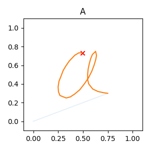
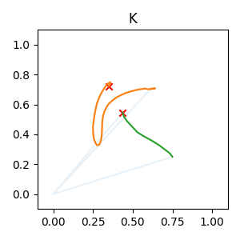
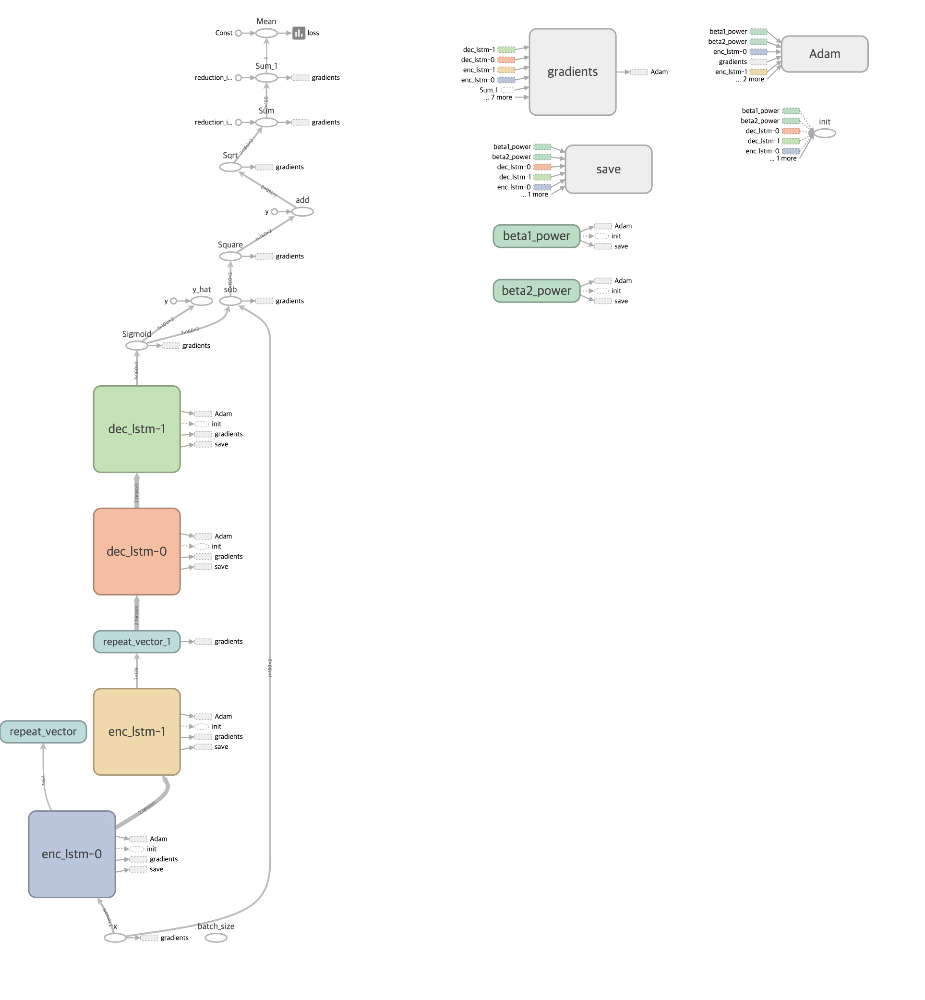
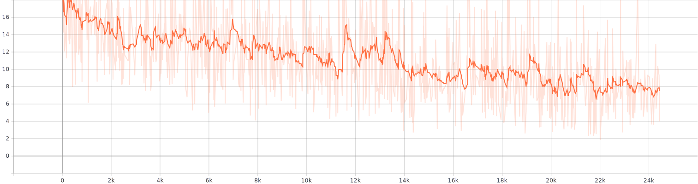
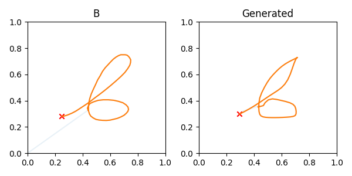

Sequence Autoencoder with UJI Pen Characters Dataset
=====
Unofficial TensorFlow implementation of Sequence Autoencoder with UJI Pen Characters Dataset.
The Keras implementation is provided as the following link.
https://github.com/kjm1559/lstm_autoencoder

The overall procedure for calculating the final output is presented in Algorithm 1.
## Usage
``` sh
$ unzip dataset_npz.zip
$ python run.py
```

## Dataset
<div align="center">
  <p>
    
    
  </p>
  <p>Sample view of UJI Pen Characters V1 [1]. The left figure uses only one pen stroke and the right one uses two pen strokes.</p>
</div>

## Result
<div align="center">
  <p>
    
  </p>
  <p>Neural network architecture referenced from DeVries et al. [2].</p>
</div>

## Result
<div align="center">
  <p>
    
  </p>
  <p>Loss graph during the training procedure.</p>
</div>

<div align="center">
  <p>
    
  </p>
  <p>Generated Pen Characters from test data.</p>
</div>


## Reference
[1] Dua, D. and Graff, C. (2019). UCI Machine Learning Repository [http://archive.ics.uci.edu/ml]. Irvine, CA: University of California, School of Information and Computer Science.  
[2] DeVries, Terrance, and Graham W. Taylor. <a href="https://arxiv.org/abs/1702.05538">"Dataset augmentation in feature space."</a> arXiv preprint arXiv:1702.05538 (2017).
